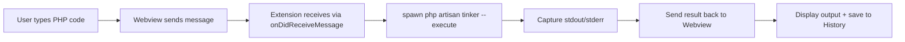

# 🪄 Artisan Tinker Runner

> A lightweight VS Code / Cursor extension to execute PHP code directly in **Artisan Tinker** from a dedicated sidebar panel.

---

## ✨ Features

| Feature | Description |
|---------|-------------|
| 🖥️ **Sidebar Panel** | Dedicated panel in Activity Bar, always accessible, theme-aware |
| ⚡ **Quick Execution** | Run PHP code via `php artisan tinker --execute` safely |
| 📜 **Execution History** | Auto-saves successful snippets (up to 15) with timestamps |
| ⌨️ **Keyboard Shortcuts** | `Ctrl+Enter` / `Cmd+Enter` to execute instantly |
| 🔍 **Debug-Friendly** | Built-in status indicators & Webview DevTools support |
| 🌐 **Cross-Editor** | Works natively in VS Code and Cursor |
| 📦 **Zero Config** | Just open a Laravel project and start tinkering |
| 🔐 **Safe Execution** | Each run is isolated; no memory leaks from persistent processes |

---

## 📦 Installation

### From Marketplace (Recommended)
1. Open **VS Code** or **Cursor**
2. Press `Ctrl+Shift+X` (Extensions)
3. Search: `Artisan Tinker Runner`
4. Click **Install** → Reload when prompted

### From VSIX (Local/Offline/Development)
```bash
# Clone or download the extension
git clone https://github.com/abcprintf/artisan-tinker-runner.git
cd artisan-tinker-runner

# Install dependencies
npm install

# Package the extension
vsce package --allow-missing-repository --no-license

# Install in VS Code
code --install-extension ./artisan-tinker-runner-*.vsix

# Or install in Cursor
cursor --install-extension ./artisan-tinker-runner-*.vsix
```

---

## 🚀 Usage

### Basic Flow
```
1. Open a Laravel project (must contain `artisan` in root)
2. Click the 🪄 terminal icon in the Activity Bar (left sidebar)
3. Type or paste PHP code in the editor
4. Press ▶ Execute or Ctrl+Enter / Cmd+Enter
5. View output instantly below the button
6. Use the 📜 History dropdown to recall previous snippets
```

### Example Code Snippets
```php
// Query a model
User::find(1)->name;

// Run a custom function
app()->environment();

// Debug with dump()
dump(config('app.name'));

// Complex query with relationships
App\Models\Order::with('user')->where('status', 'pending')->get();
```

### Keyboard Shortcuts
| Action | Windows/Linux | macOS |
|--------|---------------|-------|
| Execute Code | `Ctrl + Enter` | `Cmd + Enter` |
| Open Command Palette | `Ctrl + Shift + P` | `Cmd + Shift + P` |
| Search Command | Type: `Run Artisan Tinker` | Same |

---

## 🛠️ Development Setup

### Prerequisites
- 🐘 **PHP 8.0+** installed & available in system `PATH`
- 📁 **Node.js 18+** & **npm** for extension development
- 💻 **VS Code 1.85+** or **Cursor** (latest stable)
- 🔧 **vsce** CLI for packaging: `npm install -g @vscode/vsce`

### Project Structure
```
artisan-tinker-runner/
├── .vscode/
│   ├── launch.json          # Debug configuration
│   └── tasks.json           # Build tasks
├── src/
│   └── extension.js         # Main extension code
├── package.json             # Extension manifest
├── README.md                # This file
├── LICENSE                  # MIT License
├── icon.png                 # Extension icon (128x128)
└── .gitignore              # Ignored files
```

### Step-by-Step Setup
```bash
# 1. Clone the repository
git clone https://github.com/abcprintf/artisan-tinker-runner.git
cd artisan-tinker-runner

# 2. Install dependencies
npm install

# 3. Open in VS Code / Cursor
code .
# or
cursor .

# 4. Start debugging (F5)
# - Opens Extension Development Host
# - Auto-activates on Laravel project detection

# 5. Make changes & test
# - Edit src/extension.js
# - Save → Auto-reloads in Development Host

# 6. Lint & Package
npm run lint                    # Run ESLint
vsce package                    # Create .vsix file
```

### Debugging Tips
| Tool | Command | Purpose |
|------|---------|---------|
| Extension Host Log | `Ctrl+Shift+P` → `Developer: Show Logs` → `Extension Host` | View Node.js errors |
| Webview Console | `Ctrl+Shift+P` → `Developer: Open Webview Developer Tools` | Debug UI/JavaScript |
| Reload Window | `Ctrl+Shift+P` → `Developer: Reload Window` | Refresh extension state |
| Toggle DevTools | `Ctrl+Shift+I` | Open main editor DevTools |

---

## ⚙️ How It Works

### Execution Flow


### Technical Details
- **Process Spawning**: Uses Node.js `child_process.spawn()` with `shell: false` to safely pass PHP code without shell interpretation
- **Output Handling**: Streams `stdout`/`stderr` in real-time for immediate feedback
- **History Storage**: Uses Webview `localStorage` for persistent snippet history (scoped to extension)
- **Theme Integration**: CSS variables (`var(--vscode-*)`) automatically adapt to VS Code/Cursor themes

### Security Considerations
- ✅ No `eval()` or dynamic code execution in extension host
- ✅ Code runs in isolated Tinker process per execution
- ✅ No network requests or external data collection
- ✅ CSP policy restricts Webview to inline scripts only

---

## 🐛 Troubleshooting

| Issue | Solution |
|-------|----------|
| `php: command not found` | Ensure PHP is in system `PATH`. Test with `php -v` in terminal |
| `artisan file not found` | Open the Laravel project **root folder** as workspace (not subfolder) |
| Webview shows blank/white | `Ctrl+Shift+P` → `Developer: Open Webview Developer Tools` → Check Console tab |
| Output shows `(no output)` | Use `echo`, `return`, or `dump()` to see results. Tinker `--execute` only returns explicit output |
| Syntax error with `$`, `()`, `;` | Extension now uses `shell: false` — update to v2.3.0+ |
| History not saving | Check Webview Console for `localStorage` errors; ensure no ad-blockers |
| Theme colors not applying | Reload window after theme change; extension uses CSS variables |

### Want Persistent REPL State?
This extension uses `--execute` for safety & speed. For full interactive REPL with state persistence:
```bash
# Use integrated terminal instead
Ctrl+` → php artisan tinker
```

---

## 🤝 Contributing

Contributions are welcome! Please follow these steps:

1. **Fork** the repository
2. **Create** your feature branch: `git checkout -b feature/amazing-feature`
3. **Commit** your changes: `git commit -m 'Add amazing feature'`
4. **Push** to the branch: `git push origin feature/amazing-feature`
5. **Open** a Pull Request

### Contribution Guidelines
- ✅ Follow existing code style (ESLint config included)
- ✅ Add tests for new features (if applicable)
- ✅ Update `README.md` for user-facing changes
- ✅ Keep PRs focused and small for easier review

### Development Commands
```bash
npm run lint          # Check code quality
npm run watch         # Auto-rebuild on changes (if using TypeScript)
vsce package          # Build for distribution
vsce publish          # Publish to Marketplace (requires PAT)
```

---

## 🙏 Acknowledgments

- 🐘 [Laravel](https://laravel.com) for the amazing Tinker REPL
- 💻 [VS Code Extension API](https://code.visualstudio.com/api) for the powerful extensibility
- 🎨 [Monaco Editor](https://microsoft.github.io/monaco-editor/) inspiration for future enhancements
- 👥 All contributors and users who provide feedback

---

## 📬 Support & Feedback

- 🐛 **Bug Reports**: [GitHub Issues](https://github.com/abcprintf/artisan-tinker-runner/issues)
- 💡 **Feature Requests**: [GitHub Discussions](https://github.com/abcprintf/artisan-tinker-runner/discussions)
- 📝 **Documentation**: This README + inline code comments
- 🔄 **Updates**: Watch the repository for release notifications

---

✅ **Ready to use!** Install, open a Laravel project, and start tinkering instantly. 🪄✨