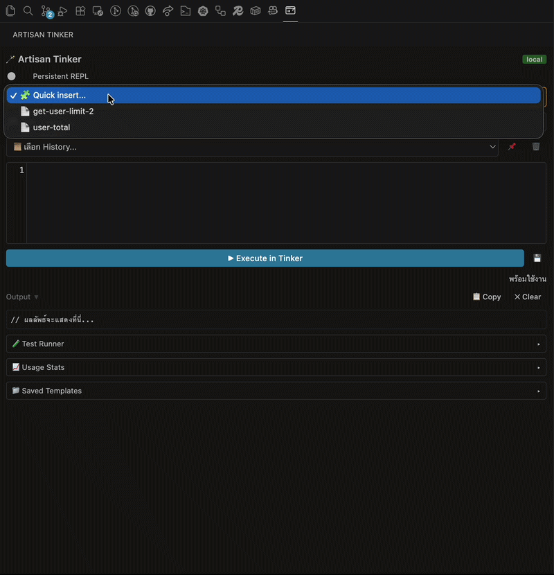

# 🪄 Artisan Tinker Runner

> A lightweight VS Code / Cursor extension to execute PHP code directly in **Artisan Tinker** from a dedicated sidebar panel — no terminal, no file switching, no setup.

**Developed by [abcprintf](https://github.com/abcprintf) · [workitdee.com](https://workitdee.com)**



---

## ✨ Features

| Feature | Description |
|---------|-------------|
| 🖥️ **Sidebar Panel** | Dedicated panel in Activity Bar, always accessible, theme-aware |
| 🎨 **PHP Code Editor** | Syntax highlighting, line numbers, bracket matching & auto-close — powered by CodeMirror |
| ⚡ **Quick Execution** | Run PHP code via `php artisan tinker --execute` safely |
| 🛑 **Stop Process** | Kill a runaway or infinite-loop process instantly with the Stop button |
| 📜 **Execution History** | Auto-saves successful snippets (up to 15) with timestamps |
| 🔍 **Search History** | Filter history dropdown in real-time by keyword |
| 🎨 **Pretty-Print Output** | Auto-formats JSON and `var_dump`/`print_r` output for readability |
| ⏱️ **Execution Time** | Shows elapsed milliseconds after each run |
| 📋 **Copy / Clear Output** | One-click copy to clipboard or clear the output area |
| 🛡️ **Friendly Error Messages** | Human-readable errors for PHP not found, missing artisan, and crashes |
| ⌨️ **Keyboard Shortcut** | `Ctrl+Enter` / `Cmd+Enter` to execute instantly |
| 🌓 **Auto Theme Sync** | UI adapts automatically to any VS Code / Cursor theme |
| 🌐 **PHP Path Auto-Detect** | Detects `php` from PATH automatically; override in settings |
| ⏰ **Timeout Guard** | Kills runaway processes after a configurable timeout (default 30s) |
| ⚡ **Execution Cache** | Caches results for identical code within a TTL window (default 30s) |
| 🐳 **Sail / Docker Auto-Detect** | Detects `vendor/bin/sail` and switches to `sail tinker` automatically |
| 🪟 **WSL Support** | Routes execution via `wsl` for WSL workspace paths |
| 🔄 **Persistent REPL** | Optional toggle to keep a single Tinker process alive between runs |
| 🗄️ **Query Log Viewer** | Auto-detects `DB::getQueryLog()` output and renders as an interactive table |
| 🌐 **Share via Gist** | Share code + output as a secret GitHub Gist with one click |
| 🧪 **Test Runner** | Run `php artisan test` directly from the sidebar panel |
| 📈 **Usage Analytics** | Local-only stats: runs, cache hits, shares, and tests (never leaves your machine) |
| 🎓 **Interactive Tutorial** | 5-step guided walkthrough shown automatically on first install |
| 📦 **Zero Config** | Just open a Laravel project and start tinkering |
| 🔐 **Safe Execution** | `shell: false` prevents shell injection; each run is isolated |

---

## 📦 Installation

### From Marketplace (Recommended)
1. Open **VS Code** or **Cursor**
2. Press `Ctrl+Shift+X` (Extensions)
3. Search: `Artisan Tinker Runner`
4. Click **Install** → Reload when prompted

### From VSIX (Offline)
1. Download the latest `.vsix` from the [Marketplace](https://marketplace.visualstudio.com/items?itemName=workitdee.artisan-tinker-runner)
2. In VS Code: `Ctrl+Shift+P` → `Extensions: Install from VSIX...`
3. Select the downloaded file

---

## 🚀 Usage

### Basic Flow
```
1. Open a Laravel project (must contain `artisan` in root)
2. Click the 🪄 icon in the Activity Bar
3. Type or paste PHP code in the editor
4. Press ▶ Execute or Ctrl+Enter / Cmd+Enter
5. View formatted output instantly below
6. Use the 📜 History dropdown (or search box) to recall previous snippets
```

### Example Snippets
```php
// Count records
User::count();

// Inspect environment
app()->environment();

// Pretty-print an array (auto-formatted)
dump(config('app'));

// Complex query
App\Models\Order::with('user')->where('status', 'pending')->get();

// Capture query log
DB::enableQueryLog();
User::all();
$q = DB::getQueryLog();
return $q;
```

### Keyboard Shortcuts
| Action | Windows / Linux | macOS |
|--------|-----------------|-------|
| Execute | `Ctrl + Enter` | `Cmd + Enter` |
| Stop process | Click **■ Stop** button | Same |

---

## ⚙️ Settings

| Setting | Default | Description |
|---------|---------|-------------|
| `artisan-tinker-runner.phpPath` | `""` | Custom PHP executable path. Empty = auto-detect from PATH |
| `artisan-tinker-runner.timeout` | `30` | Execution timeout in seconds before the process is killed |
| `artisan-tinker-runner.cacheEnabled` | `true` | Cache results for identical code within the TTL window |
| `artisan-tinker-runner.cacheTtl` | `30` | Cache time-to-live in seconds |

---

## 🐛 Troubleshooting

| Issue | Solution |
|-------|----------|
| `❌ PHP not found` | Ensure `php` is in `PATH`. Test: `php -v` in terminal |
| `❌ No artisan file found` | Open the Laravel project **root** as workspace (not a subfolder) |
| Blank / white webview | Open Webview Developer Tools → Console tab for details |
| `(ไม่มีผลลัพธ์)` shown | Use `echo`, `return`, or `dump()` — `--execute` only captures explicit output |
| Process hangs | Click **■ Stop** to kill the process immediately |
| History not saving | Check Webview Console for `localStorage` errors |

---

## 📬 Support

- 🌐 **Website**: [workitdee.com](https://workitdee.com)
- 👤 **Author**: [abcprintf](https://github.com/abcprintf)
